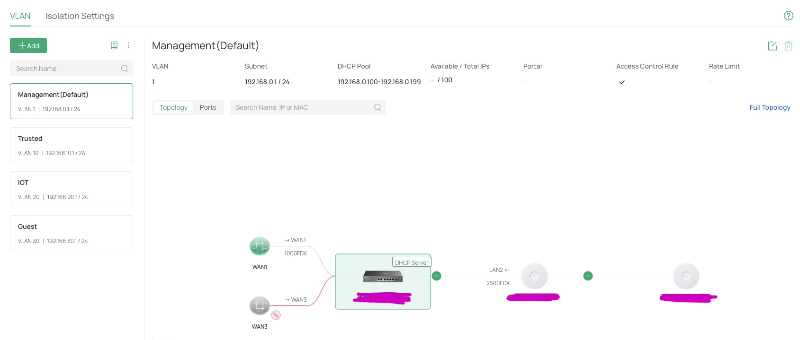
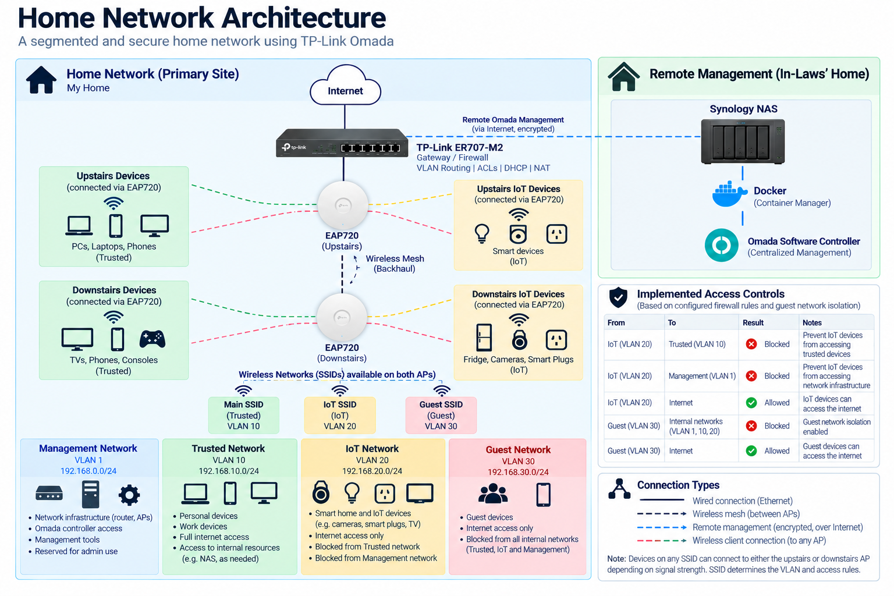
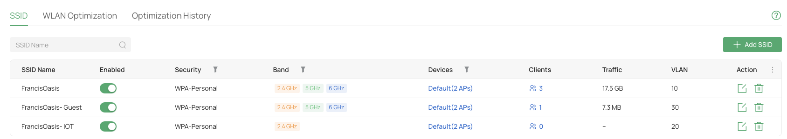
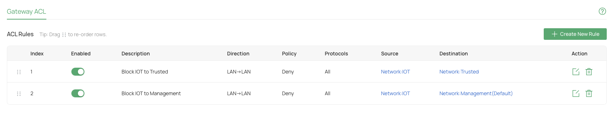
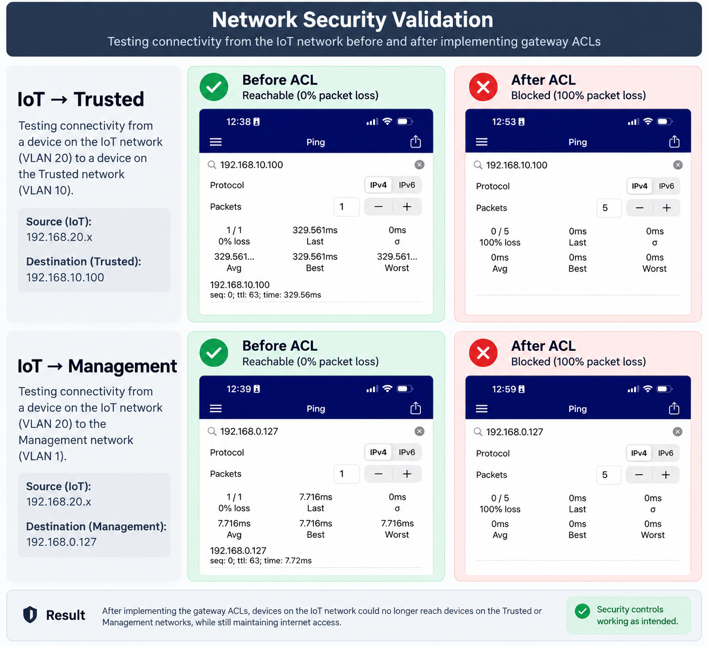

# Building and Securing My Home Network

### Applying Security+ Fundamentals in a Real Environment

After earning my CompTIA Security+ certification, I wanted my next step to be more than moving on to another certification.

Security+ gave me a solid understanding of concepts like network segmentation, access control, secure configuration, firewalls, wireless security, and reducing attack surfaces. But understanding those concepts for an exam and actually implementing them are two different things.

I wanted to see what would happen when I had to apply those principles to a network I actually use.

This project documents the design, deployment, segmentation, security, troubleshooting, and validation of my home network as my first cybersecurity home lab.

## Project Overview

**Objective:** Build and secure a segmented home network while applying cybersecurity fundamentals in a real environment.

**Key Technologies:** TP-Link Omada · VLANs · ACLs · DHCP · Docker · Synology NAS · Wi-Fi 7 · TCP/IP

**Security Concepts:** Network Segmentation · Least Privilege · Access Control · Defense in Depth · Attack Surface Reduction · Secure Configuration

### Network Segmentation

| Network | VLAN | Subnet | Purpose |
|---|---:|---|---|
| Management | 1 | 192.168.0.0/24 | Network infrastructure and management |
| Trusted | 10 | 192.168.10.0/24 | Personal and trusted devices |
| IoT | 20 | 192.168.20.0/24 | Smart and IoT devices |
| Guest | 30 | 192.168.30.0/24 | Guest connectivity |

### VLAN Configuration

The gateway was configured with four separate VLANs, each with its own subnet and DHCP scope.

*Figure 2 — VLAN configuration in the Omada controller. Device identifiers have been redacted.*

## Network Architecture

The network uses a segmented VLAN design with centralized routing and access control at the gateway. Both wireless access points broadcast the same SSIDs, allowing clients to connect through either the upstairs or downstairs AP while maintaining the same VLAN assignment and security policy.

## Environment & Technologies

The lab was built using a mix of physical networking hardware, self-hosted management software, and client devices across two physical locations.

### Core Infrastructure

- **TP-Link Omada ER707-M2** — gateway, firewall, VLAN routing, DHCP, NAT, and ACL enforcement
- **2 × TP-Link Omada EAP720** — Wi-Fi 7 access points
  - Upstairs AP connected directly to the gateway
  - Downstairs AP connected to the upstairs AP using wireless mesh backhaul
- **Synology NAS** — located at a separate physical site
- **Docker / Synology Container Manager** — used to host the Omada Software Controller
- **Omada Software Controller** — centralized management for the gateway and access points
- **Mac workstation** — used for configuration, troubleshooting, and network validation
- **iPhone** — used to test DHCP assignment, internet access, and inter-VLAN restrictions

## Self-Hosting the Omada Controller

Rather than purchasing a dedicated hardware controller, I chose to self-host the Omada Software Controller on an existing Synology NAS using Docker.

This added complexity to the project because the NAS was not located on the same local network as the Omada gateway and access points. As a result, the controller could not rely on normal Layer 2 discovery to find and adopt the devices.

The controller deployment also required troubleshooting several container-related issues, including directory mappings, persistent storage, startup errors, and rebuilding the container after correcting the data and log volume configuration.

Once the controller was running successfully, I used remote adoption and Omada cloud connectivity to bring the gateway and access points under centralized management.

This part of the project reinforced an important lesson: deploying a management platform is not just about getting the software to start. The controller has to be reachable, persistent, and correctly integrated with the network it manages.

## Designing the Network Segmentation

Once the core network was online, I wanted to reduce the amount of trust between different types of devices.

Instead of keeping every device on one flat network, I separated the environment into four logical networks based on function and risk.

### Management — VLAN 1

The Management network is reserved for infrastructure and administrative access.

**Subnet:** `192.168.0.0/24`

Typical devices and services include:

- Gateway and network infrastructure
- Wireless access points
- Management tools
- Administrative devices when needed

Separating management traffic helps reduce unnecessary exposure of infrastructure services to client devices.

### Trusted — VLAN 10

The Trusted network is used for personal and work devices that require normal access to the internet and selected internal resources.

**Subnet:** `192.168.10.0/24`

Typical devices include:

- Laptops
- Phones
- Personal computers
- Other trusted household devices

### IoT — VLAN 20

The IoT network is used for smart home and connected devices.

**Subnet:** `192.168.20.0/24`

Examples include:

- Smart appliances
- Cameras
- Smart plugs
- Televisions
- Other embedded or IoT devices

These devices generally require internet access but do not need access to trusted user devices or network management infrastructure.

### Guest — VLAN 30

The Guest network provides internet access for visitors without exposing internal resources.

**Subnet:** `192.168.30.0/24`

Guest clients are isolated from internal networks while still retaining internet connectivity.

## SSID-to-VLAN Mapping

The wireless networks were mapped directly to the appropriate VLANs:

| SSID | VLAN | Purpose |
|---|---:|---|
| FrancisOasis | 10 | Trusted devices |
| FrancisOasis-IOT | 20 | IoT devices |
| FrancisOasis-Guest | 30 | Guest devices |

Both access points broadcast the same SSIDs, so devices can associate with either the upstairs or downstairs AP while remaining in the same logical network.

This means physical location does not determine the security zone. The SSID and VLAN assignment do.

### Wireless Network Mapping

Each wireless SSID was mapped to its corresponding VLAN so that devices are placed into the appropriate network based on the SSID they join.

*Figure 3 — SSID-to-VLAN mapping for the Trusted, Guest, and IoT wireless networks.*

## Why Segmentation Alone Wasn't Enough

Creating separate VLANs was only the first step.

Because the gateway can route traffic between the VLANs, devices on different subnets could still communicate unless access controls were added.

That meant the next question was not simply:

**Which network is this device on?**

It became:

**What does this device actually need to access?**

That principle guided the firewall and ACL rules implemented next.

## Implementing Access Controls

Creating separate VLANs provided logical segmentation, but the gateway was still capable of routing traffic between those networks.

To turn that segmentation into an actual security boundary, I implemented gateway ACLs based on least privilege.

### IoT Access Controls

IoT devices need internet connectivity for normal operation, but there was no reason for them to initiate connections to personal devices or network infrastructure.

I created the following gateway ACL rules:

| Source | Destination | Action |
|---|---|---|
| IoT — VLAN 20 | Trusted — VLAN 10 | Deny |
| IoT — VLAN 20 | Management — VLAN 1 | Deny |

Internet access from the IoT network remained available.

This limits the potential impact of a compromised or insecure IoT device by preventing it from using the IoT network as a path to more sensitive parts of the environment.

### Gateway Access Control

To enforce the intended security boundaries, I configured gateway ACL rules to deny traffic from the IoT network to both the Trusted and Management networks.

*Figure 4 — Gateway ACL rules denying IoT-to-Trusted and IoT-to-Management traffic.*

### Guest Isolation

For the Guest network, I enabled Omada's built-in Guest Network isolation.

This allows guest devices to access the internet while preventing them from accessing private internal networks.

Rather than adding redundant ACLs that duplicated the same behavior, I used the platform's existing guest isolation control and validated that it produced the intended result.

### Applying Least Privilege

The goal was not to block traffic simply because I could.

For each network, I considered what its devices actually needed in order to function.

- **Trusted devices** require normal internet access and may need access to selected internal resources.
- **IoT devices** require internet access but do not need to initiate connections to Trusted or Management networks.
- **Guest devices** require internet access but should not have access to internal networks.
- **Management** is reserved for network infrastructure and administration.

This shifted the design from simply separating devices into different subnets to actively controlling communication between different trust zones.

## Testing & Validation

A configuration showing a `Deny` rule is not enough to prove that a security control is working.

After implementing the VLANs and ACLs, I tested the network from client devices to verify three things:

1. Devices were receiving addresses from the correct VLAN.
2. Restricted traffic could no longer cross security boundaries.
3. Internet connectivity continued to work after the restrictions were applied.

### Validating VLAN Assignment

I connected an iPhone to each wireless network and verified the DHCP-assigned IP address and default gateway.

| Network | Expected Subnet | Observed Address | Result |
|---|---|---|---|
| Trusted | `192.168.10.0/24` | `192.168.10.102` | Pass |
| IoT | `192.168.20.0/24` | `192.168.20.100` | Pass |
| Guest | `192.168.30.0/24` | `192.168.30.100` | Pass |

Each SSID correctly placed the client into its assigned VLAN while maintaining internet connectivity.

### Establishing a Baseline

Before applying the IoT ACLs, I tested whether a device connected to the IoT network could communicate with devices on other VLANs.

The IoT client was able to reach:

- A Mac connected to the Trusted network (`192.168.10.100`)
- A Mac interface on the Management network (`192.168.0.127`)

This confirmed an important point: creating separate VLANs had divided the network into different subnets, but inter-VLAN routing was still allowing communication between them.

### Testing IoT → Trusted

I then applied the ACL denying traffic from IoT (VLAN 20) to Trusted (VLAN 10).

I repeated the same connectivity test.

**Before ACL:** Reachable  
**After ACL:** 100% packet loss  
**Internet access:** Still available

**Result: PASS**

The IoT client could no longer initiate communication with a device on the Trusted network without losing the internet connectivity it required.

### Testing IoT → Management

I repeated the process for the Management network after applying the second ACL.

**Before ACL:** Reachable  
**After ACL:** 100% packet loss  
**Internet access:** Still available

**Result: PASS**

This confirmed that IoT devices could no longer initiate connections to the Management network.

### Before & After Validation

To verify that the ACLs were actually enforcing the intended security boundaries, I compared connectivity before and after the rules were applied.

*Figure 5 — Before-and-after connectivity testing. Prior to the ACLs, the IoT client could reach both target networks. After the ACLs were applied, both tests resulted in 100% packet loss while internet connectivity remained available.*

### Testing Guest Isolation

I also tested a client connected to the Guest SSID.

The client received an address from the Guest subnet and retained internet connectivity, while attempts to reach private internal network addresses were unsuccessful.

**Result: PASS**

This validated the behavior of Omada's built-in Guest Network isolation.

### Validation Summary

| Test | Expected Result | Observed Result |
|---|---|---|
| Trusted client receives VLAN 10 address | `192.168.10.0/24` | Pass |
| IoT client receives VLAN 20 address | `192.168.20.0/24` | Pass |
| Guest client receives VLAN 30 address | `192.168.30.0/24` | Pass |
| IoT → Trusted before ACL | Reachable | Pass |
| IoT → Trusted after ACL | Blocked | Pass |
| IoT → Management before ACL | Reachable | Pass |
| IoT → Management after ACL | Blocked | Pass |
| IoT → Internet after ACL | Allowed | Pass |
| Guest → Internal networks | Blocked | Pass |
| Guest → Internet | Allowed | Pass |

The most useful part of this testing was comparing behavior before and after the security controls were applied rather than relying solely on the configuration shown in the management interface.

## Troubleshooting & Lessons Learned

Some of the most valuable parts of this project came from the things that did not work the first time.

### 1. Remote Controller Adoption

The Omada Software Controller was hosted on a Synology NAS at a separate physical location from the network being managed.

Initially, I expected the controller to discover the Omada devices automatically. However, normal discovery relies on the controller and devices being reachable through the appropriate local network mechanisms, and my controller was not on the same Layer 2 network.

This required me to distinguish between local discovery and remote management and work through remote adoption and Omada cloud connectivity instead.

**Lesson learned:** Physical and logical network placement matters when deploying management infrastructure. A service can be running correctly while still being unable to discover or communicate with the devices it is intended to manage.

### 2. Container Deployment and Persistent Storage

Self-hosting the controller introduced another troubleshooting challenge.

During the initial Docker deployment, the controller experienced startup and logging problems related to its directory and volume mappings. I reviewed the container configuration, corrected the data and log mappings, and rebuilt the deployment.

This gave me practical experience troubleshooting a containerized application rather than treating the container as a black box.

**Lesson learned:** A running container is only one part of a successful deployment. Storage mappings, persistence, logs, networking, and application configuration all need to be considered.

### 3. VLANs Do Not Automatically Provide Isolation

After creating the Trusted, IoT, and Guest VLANs, I initially tested communication between them.

The IoT client could still reach devices on both the Trusted and Management networks.

The VLANs were working correctly—the devices were on different subnets—but the gateway was routing between those networks.

That distinction became one of the most important lessons from the project.

**Lesson learned:** Segmentation and access control are related but different concepts. VLANs create logical network boundaries; firewall or ACL policies determine what traffic is permitted to cross those boundaries.

### 4. Understanding the Test Path

While validating the ACLs, my Mac had both Wi-Fi and wired Ethernet active.

The Wi-Fi interface was connected to the Trusted network while the wired interface was connected to the Management network. This meant the same physical computer had addresses in two different security zones.

That forced me to pay closer attention to which IP address and interface I was actually testing rather than thinking only in terms of "pinging my Mac."

**Lesson learned:** A meaningful network test requires understanding the complete traffic path—source interface, source network, destination interface, destination network, routing, and the security controls in between.

### 5. Validate the Control, Not the Configuration Screen

One of the biggest takeaways from the project was that seeing a rule marked `Deny` in a management interface does not prove that the rule works.

For the IoT restrictions, I first established that cross-VLAN communication was possible. I then implemented the ACL, repeated the same test, and observed that the traffic was blocked while internet connectivity remained available.

The process became:

**Establish baseline → Implement control → Retest → Verify expected behavior**

That validation approach is something I plan to carry into future security and cloud projects.

## What I Learned

This project turned several concepts I had studied for Security+ into things I could observe and troubleshoot in a real environment.

I gained practical experience with:

- Network segmentation using VLANs
- IPv4 subnetting and DHCP scopes
- Inter-VLAN routing
- Gateway ACLs and least-privilege access
- Wireless SSID-to-VLAN mapping
- Guest network isolation
- Docker-based application deployment
- Remote network management
- Layer 2 versus routed connectivity
- Network testing and validation
- Troubleshooting across multiple network interfaces

More importantly, the project changed how I approach technical problems.

Instead of only asking whether a configuration looks correct, I learned to form a hypothesis, test the expected behavior, interpret the result, and use that evidence to determine what to change next.

## Next Steps

This project focused on applying networking and security fundamentals in a physical environment.

My next step is to take the same principles into AWS: network segmentation, routing, access control, least privilege, and validation—then compare how those concepts are implemented in a cloud environment.

Security+ gave me the fundamentals. This project gave me somewhere to apply them. AWS is next.
